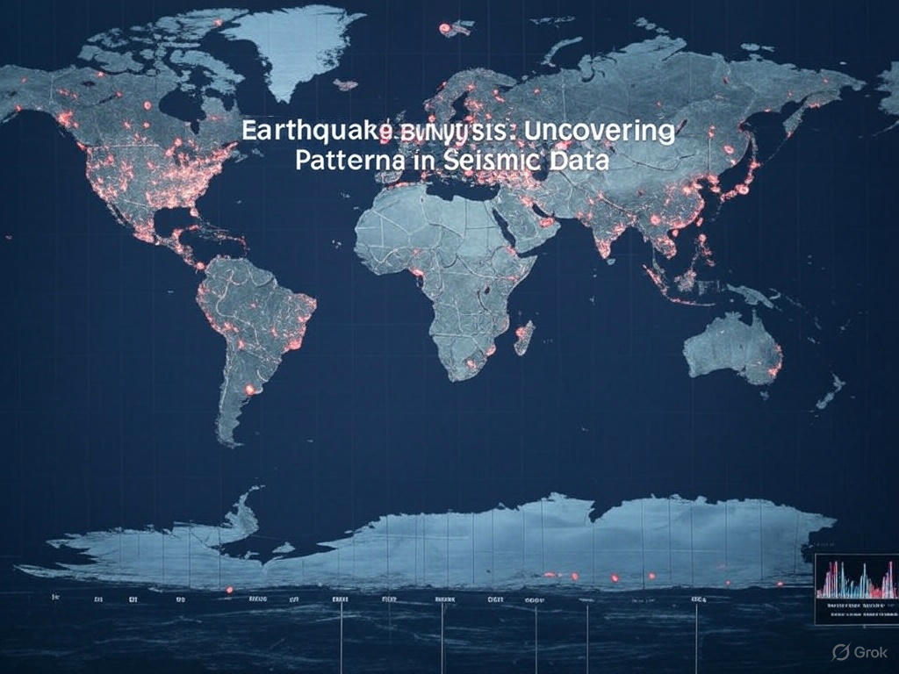

# 🌍 Earthquake Analysis


## 📊 Overview
This project offers a comprehensive analysis of global earthquake data, aimed at uncovering patterns, trends, and potential societal impacts of seismic activity. By leveraging robust data science tools and visualizations, we explore the dynamics of earthquakes from both temporal and spatial perspectives.

Understanding earthquakes is essential not only for geoscientific research but also for developing strategies for disaster preparedness and risk mitigation in vulnerable regions. This analysis provides valuable insights into seismic activity across the globe.



---

## 📁 Project Structure

The Jupyter Notebook included in this repository is structured into the following key sections:

### 1. 🔍 Introduction
An overview of the context, motivation, and objectives of the analysis. This section outlines:
- The geological causes of earthquakes.
- The importance of studying seismic activity in both scientific and societal contexts.
- Key questions that guide the analysis.

### 2. 🗃️ Data Acquisition & Loading
Details on how the earthquake dataset is sourced and processed. This includes:
- The origin and credibility of the dataset (e.g., USGS, EMSC).
- Data format and structure.
- Tools used for loading and preparing the data (e.g., `pandas`).

### 3. 📈 Exploratory Data Analysis (EDA)
A deep dive into the data to uncover meaningful insights, including:
- **Magnitude Distribution**: Understanding the scale and frequency of seismic events.
- **Geographical Frequency**: Identifying regions with heightened seismic activity.
- **Temporal Patterns**: Analyzing how earthquake occurrences change over time.

### 4. 🗺️ Data Visualization
Insightful and compelling visualizations are presented using:
- **`matplotlib` and `seaborn`** for statistical charts and graphs.
- **`geopandas`** (optional) for mapping earthquake locations and intensities.
These visualizations help reveal complex relationships in the data.

### 5. 🧾 Conclusions
Key takeaways and interpretations from the analysis are discussed. This section reflects on:
- Observed patterns and anomalies.
- Potential applications for urban planning, early warning systems, and public awareness.
- Suggestions for future work, including the integration of real-time data and predictive modeling.

---

## 🛠️ Requirements

To run the notebook locally, make sure the following Python libraries are installed:

```bash
pip install pandas numpy matplotlib seaborn geopandas
```

### Required Libraries
- `pandas`: Data manipulation and analysis.
- `numpy`: Numerical computing.
- `matplotlib`: Creating basic plots and charts.
- `seaborn`: Enhanced statistical visualizations.
- `geopandas`: Spatial data analysis and mapping (optional but recommended for geographical insights).

---

## 📌 Notes
- The notebook is beginner-friendly and well-commented.
- It serves both as a data science portfolio piece and a practical tool for learning about earthquake data analysis.

---

## 📬 Feedback & Contributions

Contributions, suggestions, and questions are welcome! Feel free to open an issue or submit a pull request if you’d like to improve or extend the analysis.
